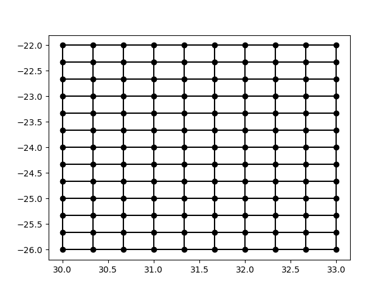

# Handling rectangular grids in CF

a Rectangular grid is defined, for this document, as a grid (or mesh) in which:

- Each cell is rectangular (in a given coordinate system)
- The cells align exactly with the X and Y (or latitude and longitude) directions.

NOTE: This is slightly more complex than a "regular" grid, in which all the cells are the same size -- in this case the width or height of teh cells may change, but all the cells in a "row" will have the same height, and all the cells in a "column" have the same width.

With this definition, you can fully define the grid with a 2 1D vectors, defining the location of the nodes of the grid, e.g.

```
 node_lon = -26, -25.6666666666667, -25.3333333333333, -25,
    -24.6666666666667, -24.3333333333333, -24, -23.6666666666667,
    -23.3333333333333, -23, -22.6666666666667, -22.3333333333333, -22 ;

 node_lat = 30, 30.3333333333333, 30.6666666666667, 31, 31.3333333333333,
    31.6666666666667, 32, 32.3333333333333, 32.6666666666667, 33 ;
```

This fully describes a simple grid:




